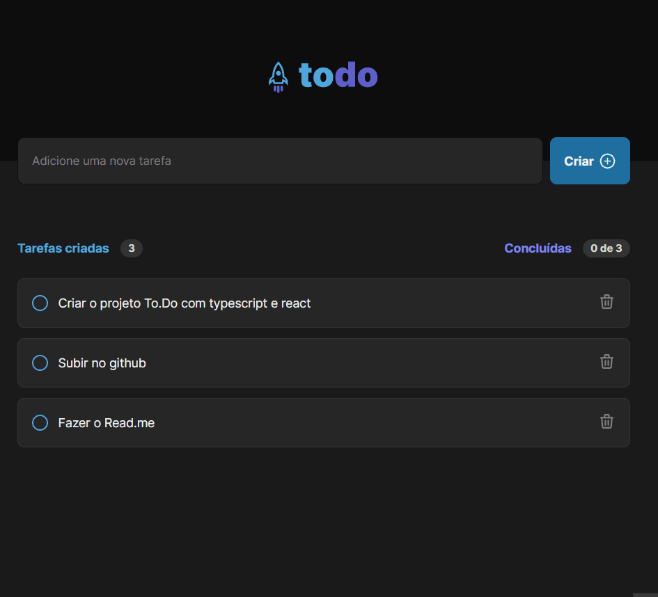

## 💻 Projeto
O projeto ToDO consistia em aplicar conceitos introdutórios de React com Tyoescript no desenvolvimento do zero desde a estrutura básica de criação com vite até 
implementação de criação e exclução de tarefas e features como de contabilização de tarefas criadas e também de tarefas realizadas.

## 🚀 Tecnologias utilizadas

<ul>
  <li>Vite</li>
  <li>CSS Modules</li>
  <li>Typescript</li>
  <li>Local Storage</li>
</ul>

## 🔖 Layout do Projeto

O layout pode ser visto através do Figma

[Layout Web](https://www.figma.com/file/0n0zDN7zbzhRbaEO74Xesx/ToDo-List/duplicate)
